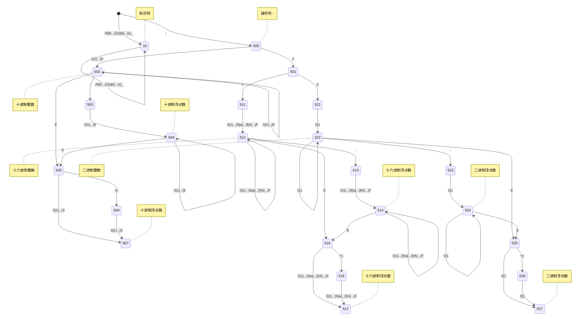

```mermaid
stateDiagram-v2

[*] --> 10: A|B|...|Z|a|b|...|z|_
10 --> 10: A|B|...|Z|a|b|...|z|_
note left of 10: 标识符
[*] --> 500: -
note left of 500: 操作符 -
500 --> 501: 0
501 --> 511: x
501 --> 521: b
500 --> 502: 1|2|...|9
502 --> 502: 0|1|...|9
note right of 502: 十进制整数
502 --> 503: .
503 --> 504: 0|1|...|9
504 --> 504: 0|1|...|9
note left of 504: 十进制浮点数
502 --> 505: E
504 --> 505: E
505 --> 506: +|-
505 --> 507: 0|1|...|9
506 --> 507: 0|1|...|9
note left of 507: 十进制浮点数
511 --> 512: 0|1|...|9|a|...|f|A|...|F
512 --> 512: 0|1|...|9|a|...|f|A|...|F
note right of 512: 十六进制整数
512 --> 513: .
513 --> 514: 0|1|...|9|a|...|f|A|...|F
514 --> 514: 0|1|...|9|a|...|f|A|...|F
note left of 514: 十六进制浮点数
512 --> 515: E
514 --> 515: E
515 --> 516: +|-
515 --> 517: 0|1|...|9|a|...|f|A|...|F
516 --> 517: 0|1|...|9|a|...|f|A|...|F
note left of 517: 十六进制浮点数
521 --> 522: 0|1
522 --> 522: 0|1
note right of 522: 二进制整数
522 --> 523: .
523 --> 524: 0|1
524 --> 524: 0|1
note left of 524: 二进制浮点数
522 --> 525: E
524 --> 525: E
525 --> 526: +|-
525 --> 527: 0|1
526 --> 527: 0|1
note left of 527: 二进制浮点数

```